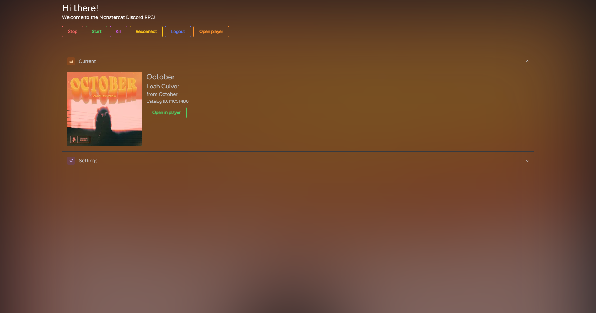

 

# mcat-discord-rpc

A Discord RPC App for the Monstercat Player

## But why?

Well, I love the Spotify RPC for Discord and I also love the Monstercat Player. But there was something missing... You probably guessed it, I wanted a Discord RPC for it. That's why I developed this application.

## How to use

0. Create a [Monstercat Account](https://monstercat.com)
1. Log in to [the player](https://player.monstercat.app) using your account.
2. Open your Discord Client
3. Download and open this application (Go to releases on the right)
4. Go to the player settings
5. Copy your widget URL and paste it into the application prompt (a textbox should appear in the center of the application, if you haven't already entered it)
6. Press Enter - That's it! The RPC should start automatically.
7. You can close the window opened and it will continue to run in your system tray. To shutdown, right click on the tray icon and select "Quit".
8. The application autosaves your widget URL. To reset, click the logout button.
9. Enjoy! And if you do, consider starring this Repository. Thanks!

PS: To get notified when there's a new version, you can also watch this repository for releases by choosing a custom watch method ;)

## Info

Since version 1.1, mcat-discord-rpc is using my electron react boilerplate. You can find it [here](https://github.com/RedCrafter07/erb-template). It's based on the [electron-react-boilerplate](https://github.com/electron-react-boilerplate/electron-react-boilerplate).
